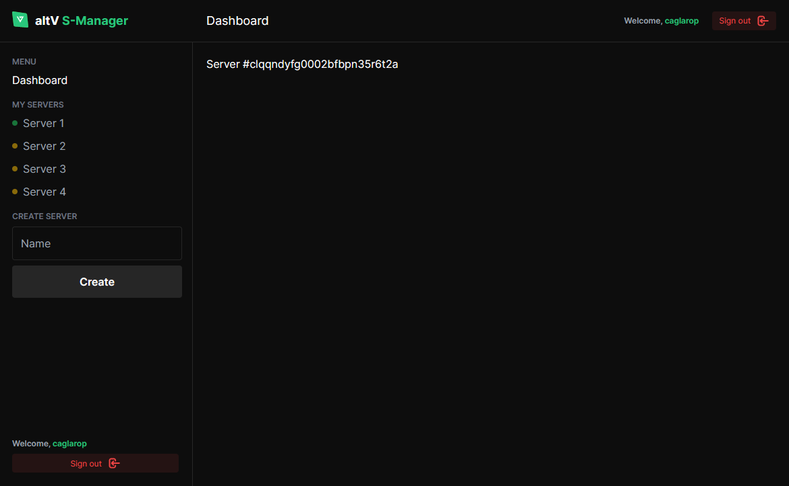

# AltV Server Manager


AltV Server Manager is a web application designed to simplify the management of AltV servers. It provides a user-friendly interface for server administrators, allowing them to monitor and control their servers with ease.



## Features to be Implemented

- [ ] Start server button
- [ ] Stop server button
- [ ] Restart server button
- [ ] Live console
- [ ] Server configuration editor
- [ ] Player list
- [ ] Player management (e.g., banning)

## Completed Features

- [x] Discord Login
- [x] Server creation
- [x] Downloading the latest altv server based on the operating system (Windows/Linux) under `server-data`
- [x] Accessing the server page in the backend
- [x] Automatic port assignment during server creation
- [x] Synchronize the port in the configuration file with the database port whenever a change is detected

## Installation

1. Clone the repository:

```bash
git clone https://github.com/caglarop/altv-server-manager.git
```

2. Install the dependencies:

```bash
npm install
```

3. Start the development server:

```bash
npm run dev
```

## Usage

After starting the development server, open your web browser and navigate to `http://localhost:3000`. From there, you can add your AltV servers and start managing them.

## Contributing

Contributions are welcome! If you have a feature request, bug report, or proposal for code improvement, please feel free to open an issue or submit a pull request.

## License

This project is licensed under the MIT License. See the [LICENSE](LICENSE) file for details.
